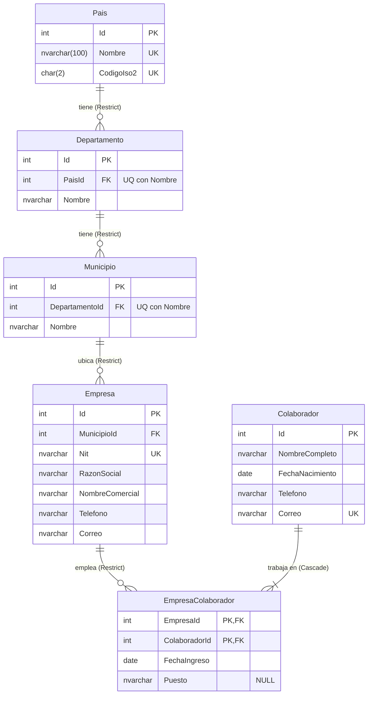

# Plan técnico

## Modelo de proceso
Modelo en V con implementación incremental. Justificación y plan de pruebas en
`docs/PLAN_PRUEBAS.md`.

## Arquitectura
Arquitectura limpia liviana, en capas con dependencias hacia adentro:

```
RRHH.Web (Razor Pages) ──HTTP──► RRHH.Api ──► RRHH.Application ──► RRHH.Domain
        │                            │                ▲
        └──────► RRHH.Contratos ◄────┴──► RRHH.Infrastructure (EF Core, SQL Server)
```

- **Contratos:** DTOs y tipos de paginación, sin dependencias. Los comparten la API y la web,
  y son parte del contrato que recibe el agente tester.
- **Domain:** entidades y reglas propias (por ejemplo, cálculo de edad).
- **Application:** DTOs, interfaces de servicios, servicios con las reglas de negocio,
  validaciones. Depende de una abstracción del contexto de datos.
- **Infrastructure:** `RrhhDbContext`, configuraciones con Fluent API, migraciones y datos iniciales.
- **Api:** endpoints REST, `ProblemDetails`, OpenAPI.
- **Web:** Razor Pages que consumen la API con un `HttpClient` tipado. Sólo referencia a Contratos.

Decisión: no se agrega un repositorio genérico sobre EF Core. `DbContext` ya implementa
Unit of Work y `DbSet` se comporta como repositorio; los servicios lo usan directamente
(a través de una interfaz para poder probarlos). Las reglas de dependencia entre capas
se verifican con pruebas de arquitectura.

## Modelo de datos
```
Pais 1──N Departamento 1──N Municipio 1──N Empresa
                                             │ N
                                     EmpresaColaborador (FechaIngreso, Puesto)
                                             │ N
                                        Colaborador
```

| Tabla | Columnas principales | Restricciones |
|---|---|---|
| Pais | Id, Nombre, CodigoIso2 | UQ Nombre, UQ CodigoIso2 |
| Departamento | Id, PaisId, Nombre | FK Pais (Restrict), UQ (PaisId, Nombre) |
| Municipio | Id, DepartamentoId, Nombre | FK Departamento (Restrict), UQ (DepartamentoId, Nombre) |
| Empresa | Id, MunicipioId, Nit, RazonSocial, NombreComercial, Telefono, Correo | FK Municipio (Restrict), UQ Nit |
| Colaborador | Id, NombreCompleto, FechaNacimiento, Telefono, Correo | UQ Correo |
| EmpresaColaborador | EmpresaId, ColaboradorId, FechaIngreso, Puesto | PK compuesta; FK Empresa (Restrict), FK Colaborador (Cascade) |

Tipos: textos con largo máximo (`nvarchar(n)`), fechas `date`, todo `NOT NULL` salvo Puesto.

### Diagrama entidad-relación
`||--|{` indica que un colaborador tiene al menos una empresa (RN3, se valida en el servicio).
La edad no se guarda: se calcula a partir de `FechaNacimiento`.



## API
| Método | Ruta | Descripción |
|---|---|---|
| GET/POST | /api/paises | Listar (paginado, búsqueda) / crear |
| GET/PUT/DELETE | /api/paises/{id} | Detalle / editar / eliminar |
| GET | /api/paises/{id}/departamentos | Departamentos de un país |
| GET/POST, GET/PUT/DELETE | /api/departamentos, /api/departamentos/{id} | Mantenimiento |
| GET | /api/departamentos/{id}/municipios | Municipios de un departamento |
| GET/POST, GET/PUT/DELETE | /api/municipios, /api/municipios/{id} | Mantenimiento |
| GET/POST, GET/PUT/DELETE | /api/empresas, /api/empresas/{id} | Mantenimiento (detalle con geografía completa) |
| GET | /api/empresas/{id}/colaboradores | Colaboradores de una empresa |
| GET/POST, GET/PUT/DELETE | /api/colaboradores, /api/colaboradores/{id} | Mantenimiento (detalle con empresas y edad) |
| POST | /api/colaboradores/{id}/empresas | Asociar a una empresa |
| DELETE | /api/colaboradores/{id}/empresas/{empresaId} | Quitar de una empresa (no la última) |
| GET | /health | Estado de la API (prueba de humo) |

Respuestas: 200, 201 con `Location`, 204, 400 `ValidationProblem`, 404, 409 `ProblemDetails`.
Listados paginados: `?pagina=1&tamanio=20&buscar=texto`.

## Base de datos y entorno
- La aplicación usa **SQL Server**. En desarrollo: LocalDB (viene con Visual Studio) o SQL Server Express.
  Opcional: `docker-compose.yml` con SQL Server para quien prefiera Docker.
- No hace falta SSMS: `dotnet ef database update` crea la base y carga los datos iniciales.
- Cadena de conexión en user-secrets de RRHH.Api (nunca en el repositorio):
  `dotnet user-secrets set "ConnectionStrings:Rrhh" "Server=(localdb)\\MSSQLLocalDB;Database=Rrhh;Trusted_Connection=True;TrustServerCertificate=True" --project src/RRHH.Api`
- Las pruebas automatizadas usan SQLite en memoria: corren sin instalar ningún motor.
- Datos iniciales: Guatemala, sus 22 departamentos y una muestra de municipios.

## Repositorio y ramas
- **Un solo repositorio** para API, web, pruebas, Postman y documentación. La separación es
  por carpetas (`src/RRHH.Api`, `src/RRHH.Web`) y por ámbito en los commits
  (`feat(api): ...`, `feat(web): ...`).
- `main` siempre compila y pasa las pruebas.
- Una rama por fase (ver `docs/TAREAS.md`), con commits pequeños.
- Al cerrar cada fase: merge a `main` con `--no-ff` (o un pull request en GitHub, con
  descripción), para que cada fase quede visible en el historial.
- Al terminar: tag `v1.0.0`.

## Convenciones de código
Ver `docs/CODIFICACION.md`: nombres, patrón de referencia por entidad, errores y pruebas.

## Documentación
- Colección de Postman en `postman/`, con entorno, ejemplos y pruebas en cada request.
- README con: cómo ejecutar, decisiones de diseño, cómo correr cada tipo de prueba y uso de IA.
